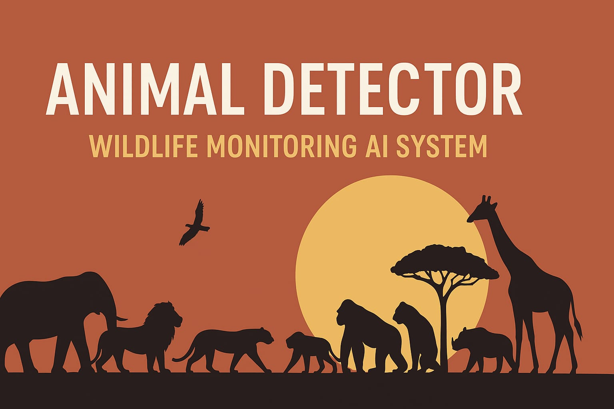

<!-- 🦁 Banner -->

  

---

# 🐘 Animal Detector – Wildlife Monitoring AI System

A smart and powerful *AI-based wildlife monitoring system* that detects wild animals like elephants, lions, tigers, and more using your webcam — and instantly plays an alert sound 🔊 when one is detected.

---

## 🎯 Overview

This project helps *forest officers and wildlife teams* monitor real-time video feeds to detect wild animals automatically.  
If a dangerous animal appears, the system raises an alert — preventing potential harm to humans or property.

### Built Using:
- 🧠 *TensorFlow + Keras* – Deep learning for animal classification  
- 🎥 *OpenCV* – Capturing and processing camera frames  
- 🎵 *Playsound* – Triggering instant alerts  
- ⚙ *Teachable Machine* – Quick and easy model training  

---

## ⚙ Features

✅ Detects multiple wild animals (Elephant, Lion, Tiger, etc.)  
✅ Ignores humans, pets, and background motion  
✅ Plays sound alerts for wild animals only  
✅ Real-time detection via webcam  
✅ Easy to customize with your own trained model  

---

## 🧩 How It Works

### 1️⃣ Model Training  
Trained on Google’s *Teachable Machine* using custom classes:
- 🐘 Elephant  
- 🦁 Lion  
- 🐯 Tiger  
- 🐆 Cheetah  
- 🐻 Bear  
- 🦍 Gorilla  
- 🦏 Rhino  
- 🐺 Hyena  
- 🚫 Non-Targets (humans, cats, dogs, etc.)  
- 🌿 Background  

### 2️⃣ Model Prediction  
- Captures live frames from the webcam  
- Resizes and normalizes images  
- Predicts animal type and confidence  
- If confidence > 80% and class is wild → plays alert sound  

### 3️⃣ Alert System  
When a target animal is detected, alert.mp3 plays instantly 🔊  

---

## 💻 Setup Instructions

### 1️⃣ Install Requirements  

pip install opencv-python tensorflow playsound==1.2.2 numpy

2️⃣ Folder Structure

Animal_Detector/
│
├── main.py
├── keras_model.h5
├── labels.txt
├── alert.mp3
└── banner.png   ← (upload this image file here later)

3️⃣ Run the Project

python main.py

Press ‘Q’ to stop the camera feed.

---

🚀 Future Enhancements

📱 Send alerts to phone via SMS or WhatsApp
☁ Upload detections to a cloud dashboard
🕹 Integration with drones or CCTV
🧠 Improve accuracy with transfer learning

---

👨‍💻 Author

Mohammed Arshad
💻 Wildlife AI Enthusiast | Data & AI Learner
🌍 [GitHub Profile](https://github.com/mohammedarshad3)

